# 🛰️ PaveCrack1300 — UAV Pavement-Crack Semantic Segmentation Benchmark

> A rigorous, leakage-safe benchmark of **three architecturally distinct** semantic-segmentation models —
> **DeepLabV3-ResNet50** (CNN + ASPP), **SegFormer-B0** (vision transformer), and **YOLOv26-Sem** (real-time) —
> for pixel-level crack detection on drone-captured pavement imagery.

<p align="center">
  
  
  
  
  
  
</p>

<p align="center">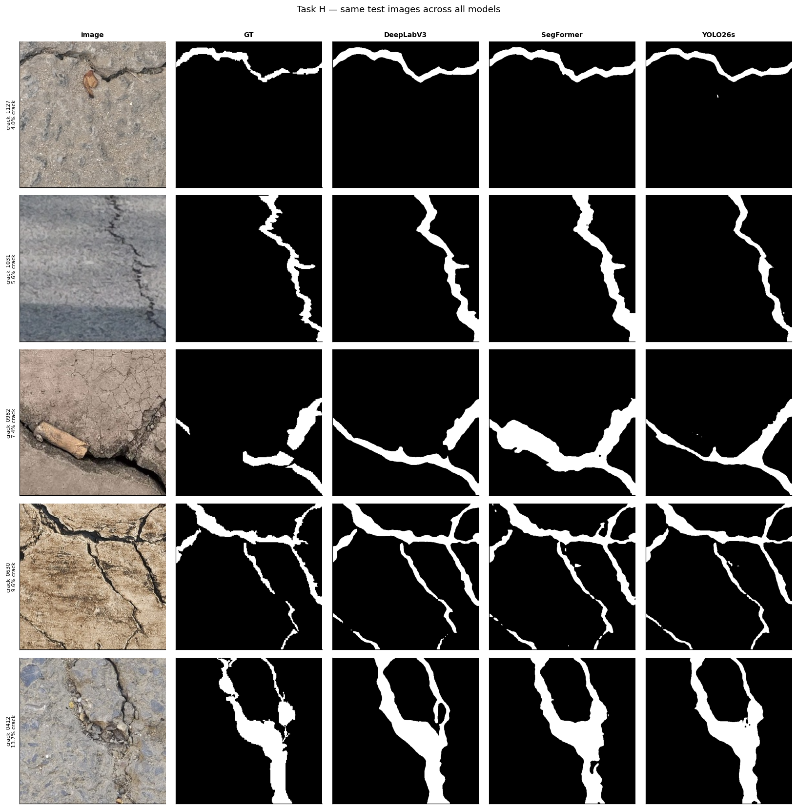</p>

<p align="center">
  📓 <b><a href="notebooks/">Notebooks</a></b> &nbsp;·&nbsp;
  📊 <b><a href="figures/">Figures</a></b> &nbsp;·&nbsp;
  🎓 <b><a href="VIVA_QUESTIONS_ANSWERED.md">Viva Questions — Answered</a></b>
</p>

> 🎓 **Preparing for the viva?** Every coding & theory question from the assignment is answered in plain English in
> **→ [`VIVA_QUESTIONS_ANSWERED.md`](VIVA_QUESTIONS_ANSWERED.md)**.

---

## 📌 TL;DR

We benchmark three segmentation models on **PaveCrack1300** (1,300 UAV pavement patches, binary *crack / background*).
All three share **one identical, leakage-safe pipeline** — only the model differs — so the comparison is genuinely fair.

| Model | mIoU | Crack IoU | Crack Dice | Pixel Acc | Params | Train time |
|---|:---:|:---:|:---:|:---:|:---:|:---:|
| 🥇 **DeepLabV3-ResNet50** | **0.8383** | **0.7204** | **0.8375** | 0.9607 | 42.0 M | 73 min |
| 🥈 **YOLOv26-Sem (s)** | 0.8345 | 0.7100 | 0.8304 | **0.9627** | 6.5 M | 39 min |
| 🥉 **SegFormer-B0** | 0.8181 | 0.6869 | 0.8144 | 0.9543 | **3.7 M** | **19 min** |

**Headline findings**
- **DeepLabV3 wins accuracy**, but **YOLOv26-Sem nearly matches it with 6.5× fewer parameters** — the accuracy-per-compute sweet spot.
- All three models are **false-positive-dominant** (they *over-segment* rather than miss cracks) — desirable for a safety-critical inspection task.
- **All three fail on the *same* images** (per-image IoU correlation **0.89–0.94**; 12 of each model's 20 hardest images are shared) → the remaining difficulty is **intrinsic to the data**, not the architecture.

<p align="center">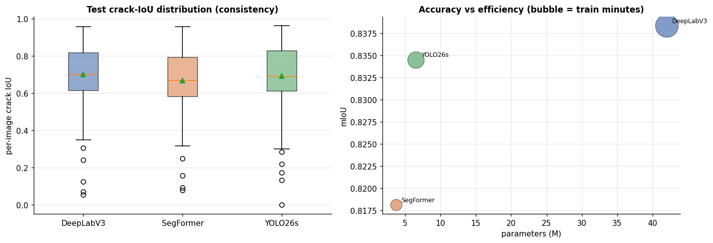</p>

---

## 📖 Table of Contents
1. [Motivation](#1-motivation--why-this-matters)
2. [Dataset](#2-dataset--pavecrack1300)
3. [Approach & design decisions](#3-approach--design-decisions-the-why-behind-every-choice)
4. [Pipeline & notebooks](#4-pipeline--notebooks)
5. [Results](#5-results)
6. [Verdict](#6-verdict--which-model-would-we-deploy)
7. [Reproduce it](#7-reproduce-it)
8. [Repository structure](#8-repository-structure)
9. [Team & course](#9-team--course)
10. [License, citation & references](#10-license-citation--references)

---

## 1. Motivation — why this matters

Road cracks are the earliest visible sign of pavement failure. Catching them early is cheap; catching them late is not.
Manual inspection is slow, subjective, and dangerous on live roads. **UAVs (drones)** can sweep a road network quickly,
but the imagery is only useful if a model can turn raw pixels into a **pixel-accurate crack map** — that is *semantic
segmentation*, not just "is there a crack somewhere in this photo?"

This project answers a practical engineering question a transport authority would actually ask:

> *"Given the same drone dataset and the same fair training budget, which modern segmentation architecture should we deploy — a heavyweight CNN, a vision transformer, or a real-time detector-turned-segmenter?"*

We answer it end-to-end: exploratory analysis → a **provably leakage-free** data split → identical training → the full
suite of segmentation metrics → structured error analysis → a deployment verdict.

---

## 2. Dataset — PaveCrack1300

**PaveCrack1300** contains **1,300 image–mask pairs** cropped from high-resolution UAV photographs of roads at
Shenyang Jianzhu University, China (DJI Mini 4 Pro). Each image is a **512 × 512 RGB** patch; each mask is a
**single-channel binary PNG** (`crack = 255`, `background = 0`).

<p align="center">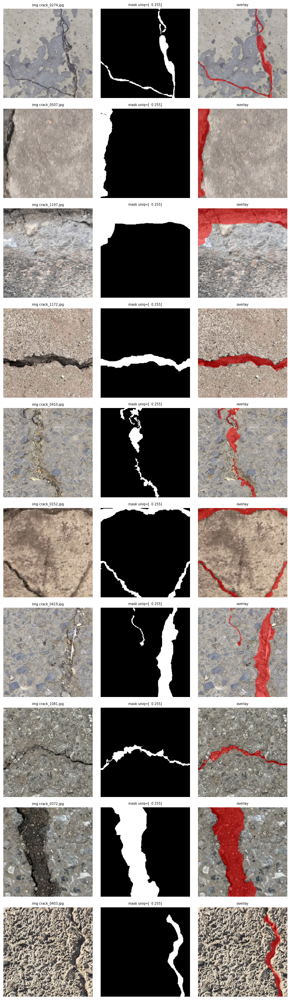</p>

**What the EDA (Notebook 1) established — and why it matters:**

| Property | Value | Why we care |
|---|---|---|
| Pairs | 1,300 (0 corrupt, 0 mismatched) | small dataset → augmentation & regularization matter |
| Resolution | uniform **512×512** | train at native size; no up/down-scaling of thin cracks |
| Classes | **2** (background, crack) | binary segmentation |
| Pixel balance | **crack ≈ 11%** vs background ≈ 89% (~8:1) | class imbalance → drives the loss choice |
| Origin | **non-overlapping** patches of larger UAV photos | patches from one road share texture → **leakage risk** |

<table>
<tr>
<td width="50%">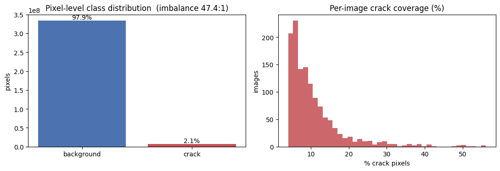</td>
<td width="50%">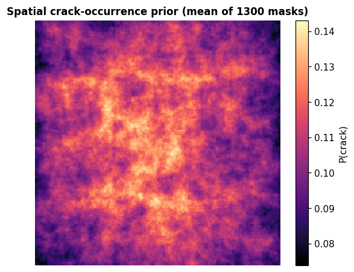</td>
</tr>
<tr>
<td align="center"><b>Class imbalance</b> — crack is only ~11% of all pixels, measured at the <i>pixel</i> level (what actually drives the loss).</td>
<td align="center"><b>Spatial prior</b> — averaging all masks reveals a mild center bias (11.9% vs 10.8%), a hint future models could exploit.</td>
</tr>
</table>

> 🔎 **A data-quality catch we're proud of.** The dataset ships a `crack_pixel_count` column that is *inconsistent* with
> the masks (it implies only ~2% crack). We cross-checked it against the pixel masks, flagged it, and compute all
> statistics **directly from the masks** — the authoritative source. Trusting the bad column would have silently mis-set
> our class weights.

<p align="center">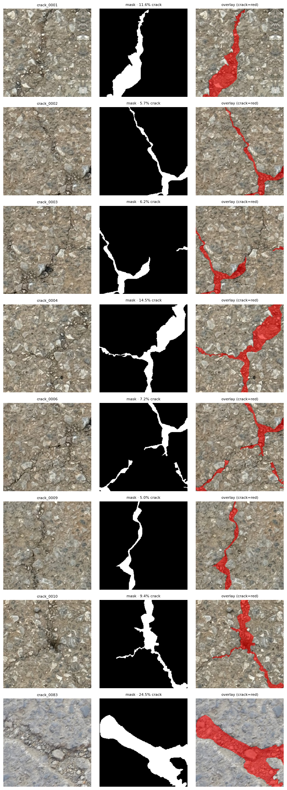</p>
<p align="center"><i>Representative pairs across the full crack-density range — from sparse hairline cracks to dense alligator cracking.</i></p>

<p align="center">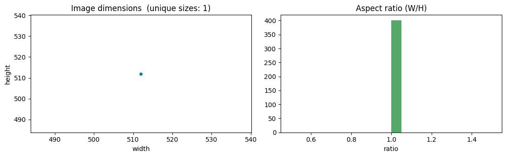</p>
<p align="center"><i>Every image is exactly 512×512 (aspect ratio 1.0) — so we train at native resolution and never rescale away thin cracks.</i></p>

---

## 3. Approach & design decisions (the *why* behind every choice)

The whole benchmark rests on one principle: **a comparison is only meaningful if the only thing that changes is the model.**
So NB2 and NB3 share a *byte-identical* pipeline (dataset, augmentation, loss, metrics, optimizer, schedule, seed) —
enforced by generating both notebooks from a single builder and asserting only the model-definition cell differs.

### 3.1 A leakage-safe split (Task B) — the hardest 10 marks

Because patches were cropped from larger photos, two patches of the same road stretch look nearly identical. If one lands
in *train* and its twin in *test*, the test score is inflated — **data leakage**. The dataset exposes **no source-photo ID**,
so we cannot group by capture directly. Our two-part fix:

1. **Empirical grouping via perceptual hashing.** We compute a **difference-hash (dHash)** for every image and union-find
   near-duplicates (Hamming ≤ 6) into groups, forcing any near-identical patches into the *same* split. (It caught a real
   exact-duplicate pair: `crack_1086 ≈ crack_1091`.)
2. **Stratified 70/15/15 by crack density**, fixed **`seed = 42`**, with an assertion that *no* sample crosses splits.

The split is saved **once** to `split.json` and **reused identically** by all three model notebooks. Result: balanced,
reproducible, and provably leakage-free (train/val/test crack coverage: 10.9% / 10.5% / 10.8%).

### 3.2 Augmentation (Task C) — train-only & synchronized

Applied **only to the training split**, with a **single `Albumentations.Compose`** so every *geometric* transform hits the
image **and** mask identically (photometric transforms touch the image only). Because these are **top-down** UAV patches,
there is no privileged "up" direction — so the full set of flips + 90° rotations is label-preserving and a strong, cheap
regularizer for a small dataset.

| Transform | p | Why |
|---|:---:|---|
| H/V Flip, Rotate90 | 0.5 | top-down view is orientation-agnostic → 8× effective data |
| Shift-Scale-Rotate | 0.5 | position & scale invariance |
| Brightness/Contrast, Gamma | 0.5 / 0.3 | robust to UAV exposure across flights |
| Gauss noise / blur | 0.2 | sensor noise & mild motion blur |

The **sanity grid (Task D)** is a required quality gate — it visually proves image↔mask stay aligned *after* augmentation:

<p align="center">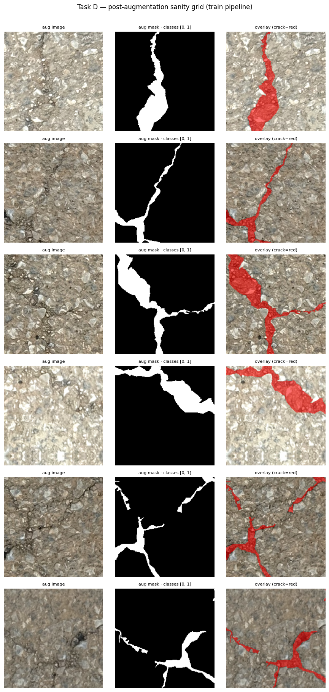</p>

### 3.3 Loss & model-selection metric

- **Loss = Dice + class-weighted Cross-Entropy.** Dice directly optimizes overlap of the minority *crack* class; a light
  CE weight (crack ≈ 4.6, computed by median-frequency balancing from the pixel histogram) improves recall without the
  gradient spikes that over-weighting causes.
- **Checkpoint on best validation *crack* IoU**, not mIoU. mIoU is dominated by the easy background class, so selecting on
  it would under-serve the class we actually care about. (We still *report* full mIoU.)

### 3.4 The three models (and why each)

| Model | Family | Why it's here |
|---|---|---|
| **DeepLabV3-ResNet50** | CNN + **ASPP** (atrous spatial pyramid) | multi-scale context via parallel dilated convs — the classic strong baseline |
| **SegFormer-B0** | hierarchical **vision transformer** + all-MLP decoder | global attention, tiny & efficient — the modern lightweight contender |
| **YOLOv26-Sem** | real-time detector adapted to per-pixel output | the "can a fast model keep up?" question |

**Unified training recipe** (identical for all): AdamW, **lr 1e-4**, weight-decay 1e-2, batch 8, **50 epochs**,
LinearLR warmup(3) → cosine annealing, AMP mixed precision, horizontal-flip test-time augmentation.

> ⚠️ **A YOLO-specific gotcha we handled.** YOLOv26-Sem reads masks where **pixel value = class ID** and **255 = "ignore"**.
> Our source masks encode crack as **255**, so we *remap 255 → 1* during conversion — leaving it unchanged would make YOLO
> silently ignore every crack pixel. We verify the converted masks contain only `{0, 1}` before training:

<p align="center">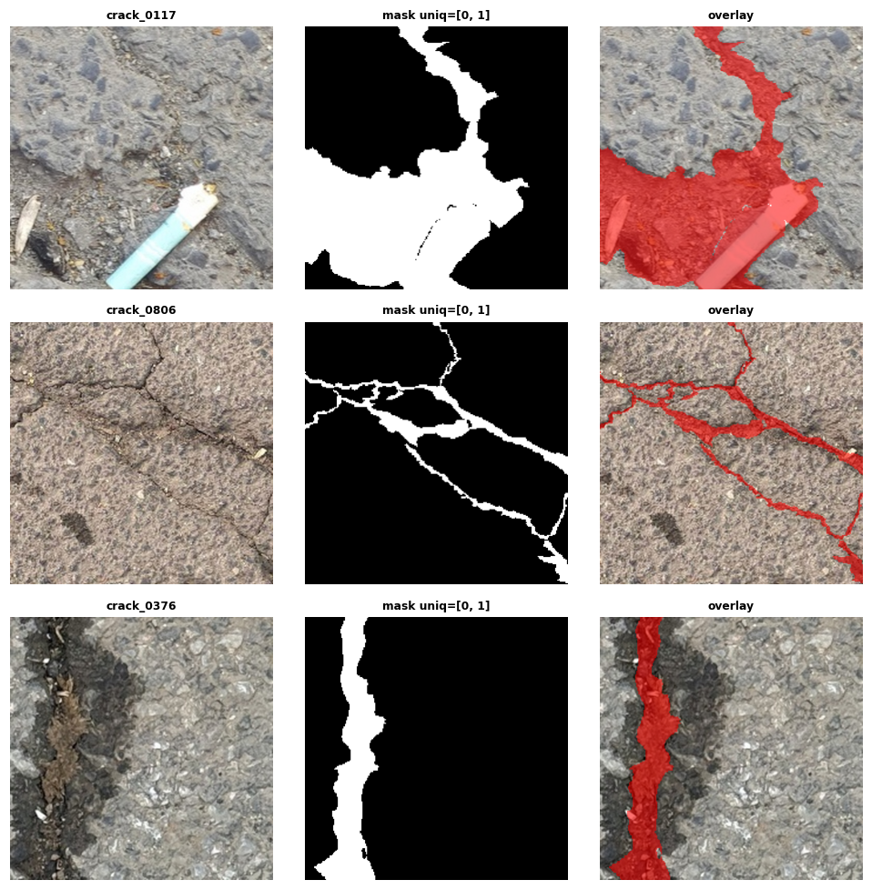</p>

---

## 4. Pipeline & notebooks

```
Notebook 0  eda-probe            → auto-discovers structure, mask encoding, the group-key question
Notebook 1  eda-and-data-prep    → Task A EDA · Task B leakage-safe split · Task C aug · Task D sanity  →  split.json
Notebook 2  seg-deeplabv3        ┐
Notebook 3  seg-segformer-b0     ├ load split.json → train ≥50 ep → Task F metrics → Task G errors → results.json
Notebook 4  seg-yolov26-semantic ┘ … + Task H: merge all 3, compare, verdict
```

Each model notebook follows the required internal order: setup → load shared split → model → **single config cell** →
training loop with live curves → test metrics → error analysis → append to `results.json`.

---

## 5. Results

### 5.1 Per-model training & diagnostics

Every model trained cleanly for 50 epochs with **no overfitting** (val tracks train), converging by ~epoch 40.

**DeepLabV3-ResNet50**
<p align="center">
  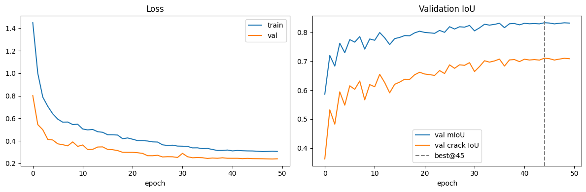
  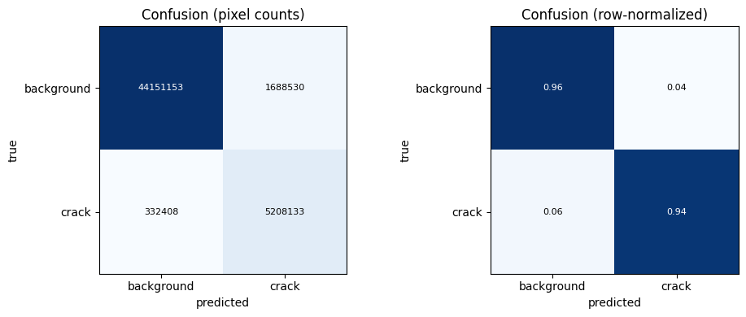
</p>

**SegFormer-B0**
<p align="center">
  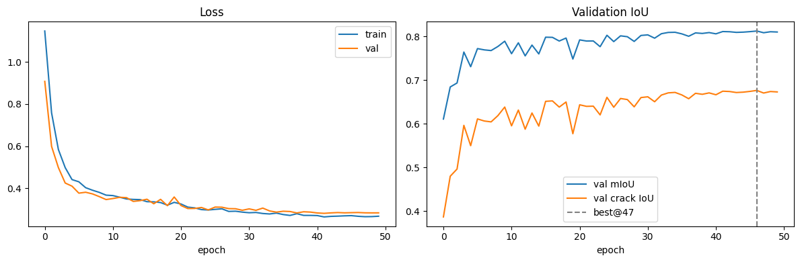
  
</p>

**YOLOv26-Sem**
<p align="center">
  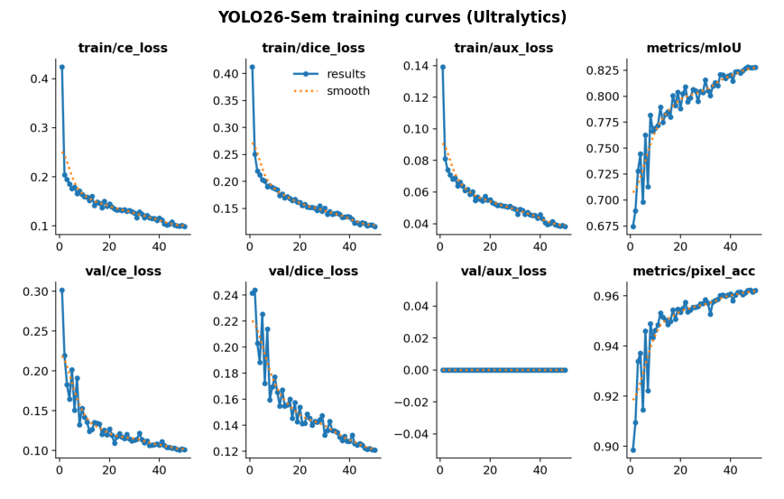
  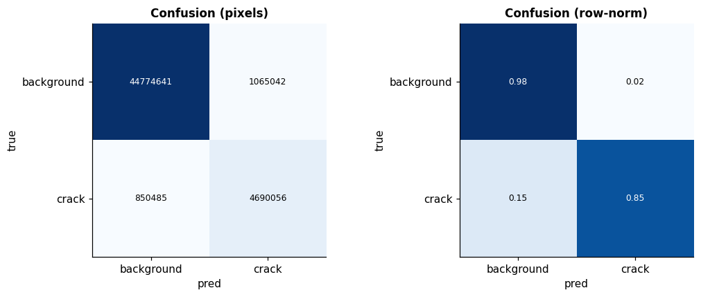
</p>

**Worst-case predictions (Task G)** — the hardest test images for each model (lowest per-image crack IoU):

<table>
<tr>
<td>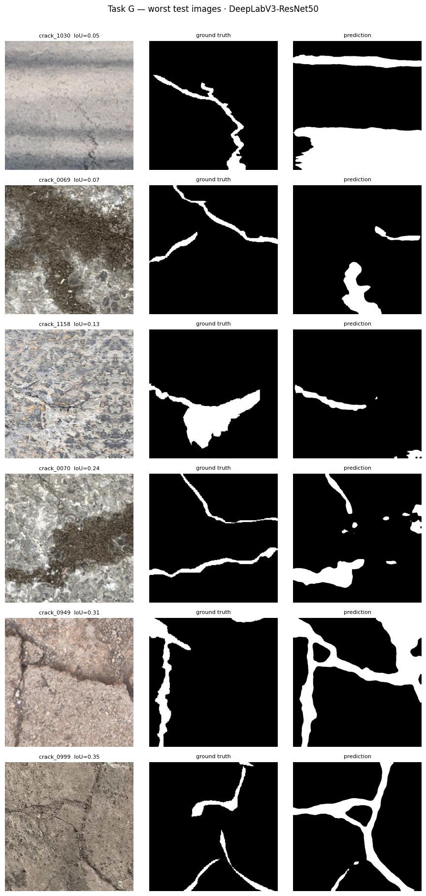</td>
<td>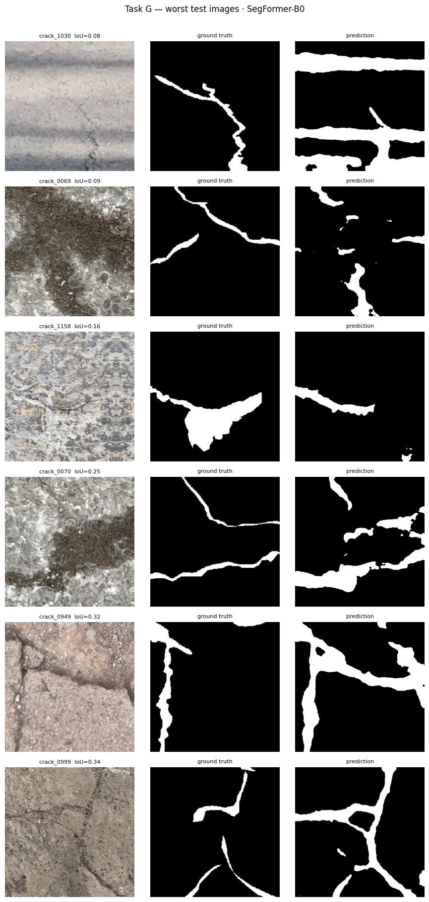</td>
<td>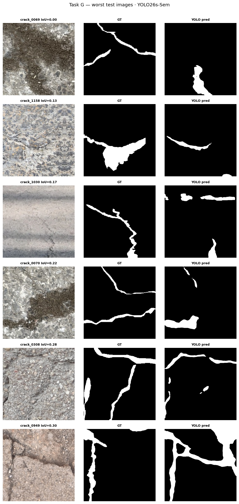</td>
</tr>
<tr><td align="center">DeepLabV3</td><td align="center">SegFormer-B0</td><td align="center">YOLOv26-Sem</td></tr>
</table>

### 5.2 Task H — head-to-head comparison

<table>
<tr>
<td width="55%">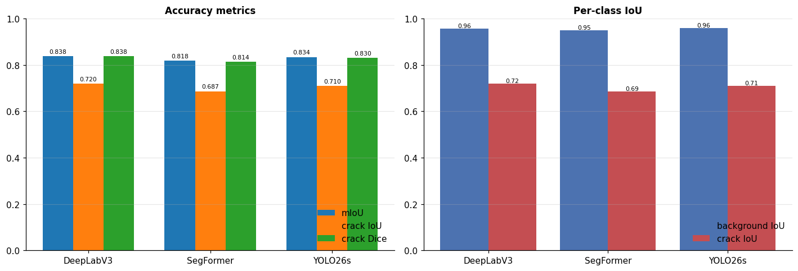</td>
<td width="45%">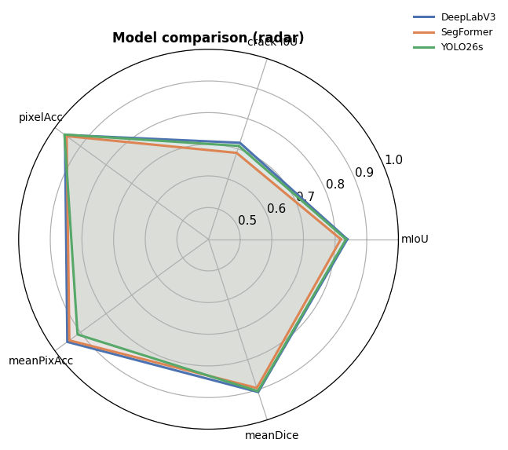</td>
</tr>
</table>

**Error maps — *where* each model fails** (TP green · FP red · FN blue). Thin red halos = boundary over-segmentation
(precision loss); blue gaps = missed thin cracks (recall loss):

<p align="center">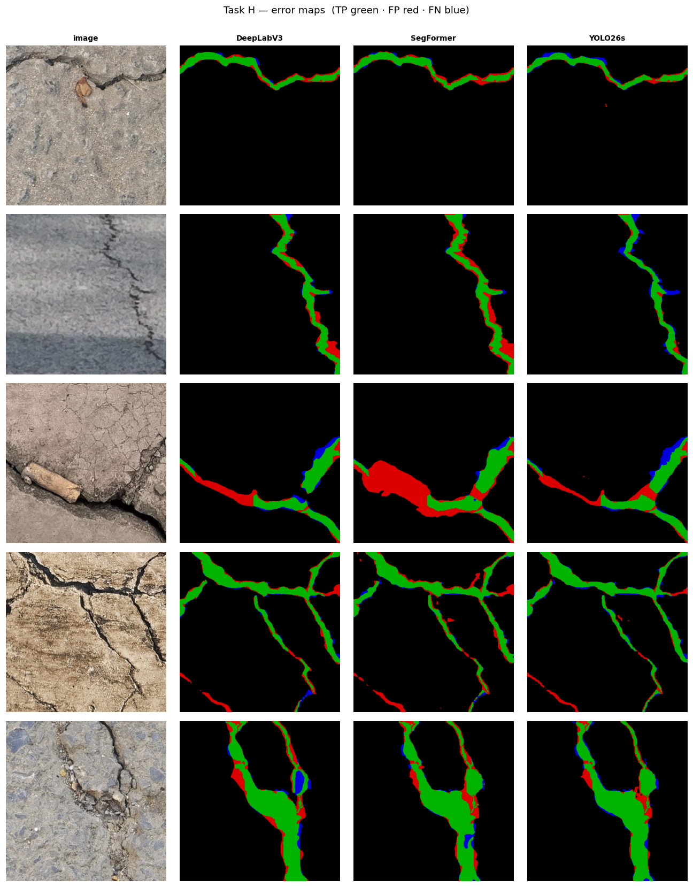</p>

**Precision–Recall (crack class).** Every model over-segments at the default 0.5 threshold; the PR curve reveals a better
operating point — directly actionable for deployment:

<p align="center">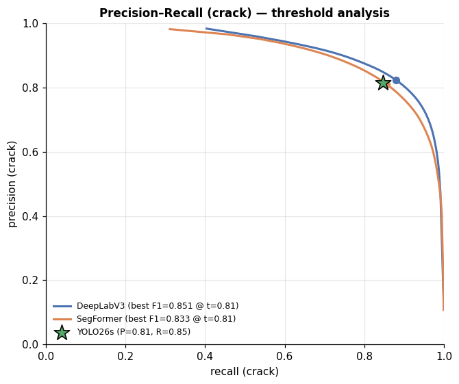</p>

### 5.3 Key scientific finding — the models fail *together*

The three models' **per-image crack IoU** are strongly correlated (**0.89–0.94**), and **12 of the 20 hardest images are
shared by all three**. Three very different architectures stumbling on the *same* images means the residual error is driven
by **intrinsically hard data** (hairline cracks, ambiguous boundaries, sealed-crack textures) rather than by any one model's
inductive bias. Practically: *more of the same architecture won't help — better data or resolution will.*

---

## 6. Verdict — which model would we deploy?

| Need | Pick | Reason |
|---|---|---|
| **Maximum accuracy** (offline survey) | **DeepLabV3-ResNet50** | best mIoU & crack IoU; compute is not the constraint offline |
| **Best accuracy per compute** | **YOLOv26-Sem** | ~matches DeepLabV3 at **6.5× fewer params**, real-time inference |
| **Most constrained hardware** | **SegFormer-B0** | smallest (3.7 M) & fastest to train, still >0.81 mIoU |

For an **on-board, real-time UAV** pipeline we would ship **YOLOv26-Sem**; for a **post-flight, accuracy-first** report we
would ship **DeepLabV3**. All three favor recall (they rarely miss a crack), which is the right bias for safety-oriented
inspection.

---

## 7. Reproduce it

The notebooks are built to run on **Kaggle (T4 GPU)** with the dataset attached.

1. **Notebook 1 (`eda-and-data-prep`)** — attach the [PaveCrack1300 dataset](https://www.kaggle.com/datasets/mantashamahi/pavecrack1300-a-uav-acquired-pavement-crack), *Run All* (CPU), **Commit**. This produces `split.json` + `class_weights.json`.
2. **Notebooks 2 & 3** — attach the raw dataset **+** Notebook 1's committed output, GPU on, *Run All*, **Commit**.
3. **Notebook 4** — attach the raw dataset + Notebooks 1/2/3 outputs, Internet **+** GPU on, *Run All*. It trains YOLO and produces the full Task-H comparison.

To keep the benchmark fair, the two PyTorch notebooks (DeepLabV3 & SegFormer) share a **byte-identical pipeline** —
the same dataset class, augmentation, loss, metrics, optimizer, schedule and seed — so the *only* difference between them
is the model definition itself.

---

## 8. Repository structure

```
.
├── README.md                        ← you are here
├── VIVA_QUESTIONS_ANSWERED.md       ← plain-English answers to every assignment question
├── notebooks/
│   ├── 0_eda-probe.ipynb            ← Phase-0 structure discovery
│   ├── 1_eda-and-data-prep.ipynb    ← EDA + leakage-safe split + augmentation + sanity
│   ├── 2_seg-deeplabv3.ipynb        ← DeepLabV3-ResNet50
│   ├── 3_seg-segformer-b0.ipynb     ← SegFormer-B0
│   └── 4_seg-yolov26-semantic.ipynb ← YOLOv26-Sem + final 3-model comparison
├── figures/                         ← all 22 charts used in this README
└── Sec 4 - Assignment Part A.pdf    ← the assignment spec
```

---

## 9. Team & course

**Course:** CSE 348 — Digital Image Processing · Department of CSE, **East West University** · Summer 2026

| # | Name | Student ID |
|---|---|---|
| 1 | MD. Asif Hossain | 2022-3-60-007 |
| 2 | _`<member 2>`_ | _`<id>`_ |
| 3 | _`<member 3>`_ | _`<id>`_ |
| 4 | _`<member 4>`_ | _`<id>`_ |

---

## 10. License, citation & references

- **Dataset:** PaveCrack1300, CC BY 4.0 — Mendeley Data, DOI [10.17632/8b27pdcxv7](https://data.mendeley.com/datasets/8b27pdcxv7) · [Kaggle mirror](https://www.kaggle.com/datasets/mantashamahi/pavecrack1300-a-uav-acquired-pavement-crack)
- **Models:** [torchvision DeepLabV3](https://pytorch.org/vision/stable/models/deeplabv3.html) · [HuggingFace SegFormer](https://huggingface.co/docs/transformers/model_doc/segformer) · [Ultralytics YOLO26 Semantic](https://docs.ultralytics.com/tasks/semantic)
- **Papers:** Chen et al., *Rethinking Atrous Convolution* (DeepLabV3), arXiv:1706.05587 · Xie et al., *SegFormer*, NeurIPS 2021

<p align="center"><sub>Built for CSE 348 · pixel-accurate crack maps for safer roads 🛣️</sub></p>
